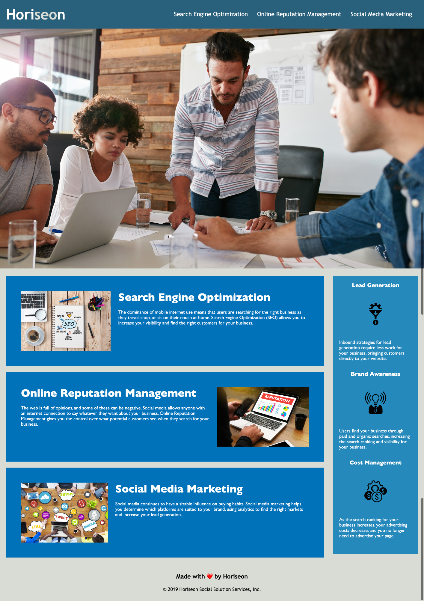

# Code Refactor Starter Code
## For Horiseon Social Solutions Website

## Description
The project was to refactoring the code from the Horiseon Social Solutions to meet the Acceptance Criteria of the user and clean up the stylesheet code so that it does not contain repetition, and to fix the HTML so that it follows HTML semantics standards and meets accessibility standards. 

The images now include alternate text to meet accessibility standards.

HTML elements now follow a logical structure and have semantic tags in place of div tags.

The title of the site now has a descriptive title. 

The CSS has been cleaned up to eliminate redundancy.

Heading styles are now listed together at the top of the stylesheet.

## Credit
UCLA Extensions Bootcamp

## Screenshot

